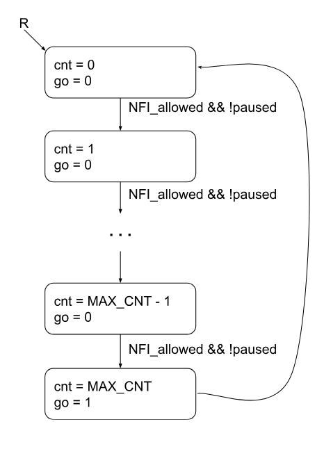
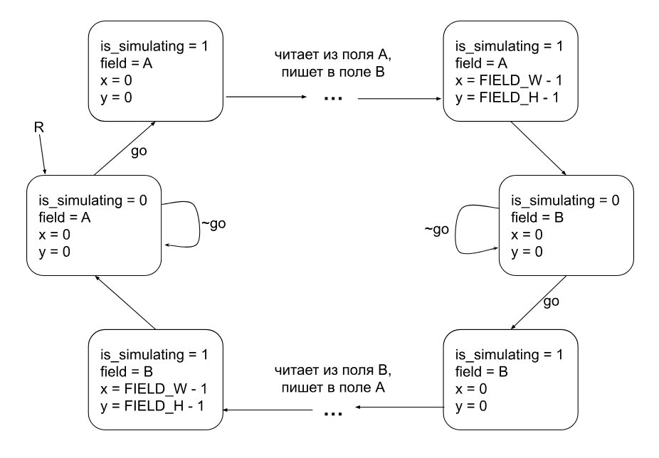
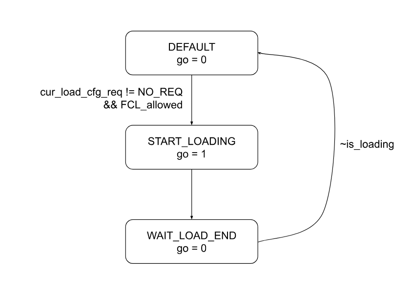

# Симулятор клеточного автомата "Игра Жизнь" на SystemVerilog

Клеточные автоматы — дискретные динамические системы, где пространство разбито на клетки с конечным числом состояний. Эволюция системы определяется локальными правилами: состояние каждой клетки обновляется на основе её соседей. [«Игра Жизнь» Конвея](https://en.wikipedia.org/wiki/Conway's_Game_of_Life) — классический пример: клетки «живут» или «умирают» в зависимости от числа соседей (2-3 для выживания, 3 для рождения). 

Данный проект представляет собой реализацию этого клеточного автомата, написанную на `SystemVerilog`. 

## Ключевые особенности

- **визуализация** состояния поля через интерфейс `VGA`; 
- переключение **паузы симуляции** сигналом снаружи, например с кнопки; 
- загрузка нескольких **подготовленных конфигураций** поля из ROM;
- почти к каждому модулю есть testbench, проверяющий основной функционал конкретного модуля;
- как часть системы тестирования, код на `C++`, взаимодействующий со скомпилированной с помощью `verilator` схемой: **отрисовка в окне GUI** пикселей, полученных с `VGA`, и **подача сигналов в схему** при нажатии клавиш на клавиатуре.

## Устройство схемы

### Краткое описание основных подсистем

Здесь приводится краткая сводка, подробное описание части систем дано ниже.

1. **Field_RAM**. Два блока RAM, хранящие состояния поля. В каждый момент времени один из них является основным _(read_field)_ и отражающим состояние поля в данный момент, а во второй записывается новая итерация при симуляции _(write field)_.
2. **Подсистема вычисления новой итерации (NFI, "next_field_iter")**. Также управляет тем, какой из блоков RAM имеет в данный момент роль _read_field_, а какой - _write field_, и переключает состояние паузы симуляции по команде снаружи.
3. **Подсистема загрузки конфигурации (FCL, "field_cfg_loader")**. Загружает в _read_field_ конфигурацию поля из ROM по команде снаружи.
4. **Подсистема вывода**. Выполняя протокол VGA, выдаёт нужные сигналы в соответствии с состоянием _read_field_.  

### Подсистема вычисления новой итерации (NFI)

Состоит из двух клеточных автоматов: [NFI_controller](./src/NFI_controller.sv) и [next_field_iter](./src/next_field_iter.sv). 

- #### NFI_controller

**Выдает команду запуска симуляции новой итерации** с минимальной задержкой в заданное число циклов, если это разрешено. Задержка позволяет искусственно замедлить частоту переходов в новое состояния поля для эстетических целей.

Диаграмма состояний:



- #### next_field_iter

Получает команду от своего контроллера на начало **вычисления нового состояния поля**. Запрашивает состояние клетки и её соседей по нужным координатам из поля _read_field_ и выдает вычисленное новое состояние клетки для его записи в _write_field_. **Чтобы гарантированно уложиться в задержки**, запрос на **чтение** по координатам (x_0, y_0) происходит **на одном такте**, а выдача вычисленного состояния для **записи** по этим же координатам - **на следующем**.

Диаграмма состояний:



### Подсистема загрузки конфигурации (FCL)

Состоит из двух клеточных автоматов: [FCL_controller](./src/FCL_controller.sv) и [field_cfg_loader](./src/field_cfg_loader.sv). Также включает в себя несколько экзепляров `ROM`, из которых **читаются выбранные для загрузки** конфигурации. Кроме того, **выполняет иницииализацю памяти (RAM)** по сигналу сброса. 

- #### FCL_controller

Получает запрос на загрузку конфигурации _(load_cfg_req)_ и выполняет его, выдавая команду загрузки конфигурации, если это разрешено. В ином случае ожидает, когда появится разрешение, запоминая последний сделанный запрос. Кроме того, по сигналу сброса сам запускает особый тип запроса - иницииализация поля `RAM` _(MEM_INIT)_.  

Диаграмма состояний:



- #### field_cfg_loader

По команде на загрузку конфигурации последовательно выдаёт координаты клетки, по которым снаружи происходит чтение из `ROM` и запись в _read_field_. Выдаёт соответствующий сигнал пока идёт загрузка (перебор координат).

## Сборка и использование

### Зависимости

Общие:

- Verilator 5.020
- GTK Wave (для просмотра waveform по команде из makefile)

Для графической визуализации симуляции _(sim_cpp)_:

- SFML 3.0

### Тестирование отдельных модулей (testbench)

Почти к каждому модулю есть testbench. Часть из них (например, для чисто комбинационных модулей) проводят автоматическую проверку. Часть генерируют случайные входные сигналы, но не проводят полностью автоматической проверки, создавая вместо этого waveform, который можно посмотреть командой `make wave`. Чтобы скомпилировать testbench вместе с синтезируемым модулем `verilator`'ом и запустить полученную программу, используйте команду:

```
make run M=*имя модуля*
```

Например, для модуля `next_cell_state`:

```
make run M=next_cell_state
```

### Графическая визуализация симуляции

Используйте следующую команду, чтобы скомпилировать все модули и `C++` исходники для графической визуализации симуляции: 

```
make sim_cpp
```

Должно открыться окно таких размеров, под которые выставлены константы протокола VGA (640 на 480), изначально целиком чёрное. Каждые два на два пикселя представляют собой одну клетку поля. Чёрный цвет означает "мёртвые" клетки, белый - "живые". Т.к. изначально поле пустое, чтобы что-то увидеть, загрузите конфигурацию (клавиши на клавиатуре `1` или `2`). Чтобы переключить паузу, нажмите `пробел`.